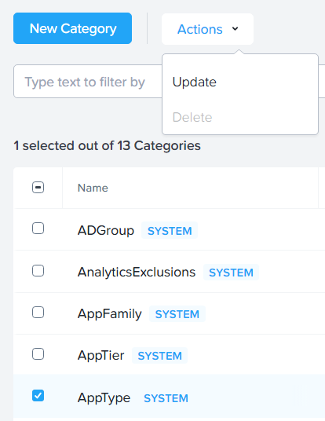
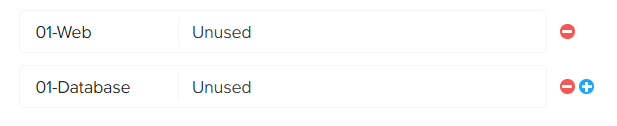
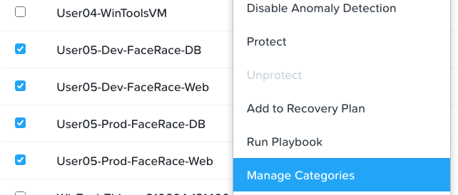
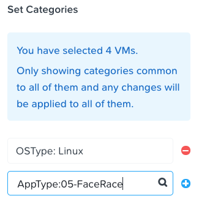
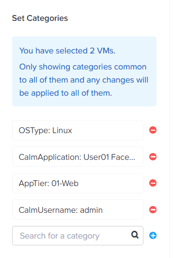
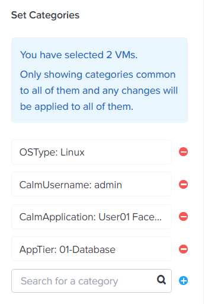

.. _detect_category:

------------------------------------------------
Configuring Flow
------------------------------------------------

Categorization
+++++++++++++++
Logging into Prism Central, and navigating to the Virtual Infrastructure > VMs page, you can see VM’s are already being created to support one of the most popular gaming apps, King Drog FaceRace. This workload is supported centrally by the Nutanix cluster compute and storage and delivered via the gaming machines on the game floor by the following VMs: 

.. raw:: html

   <strong>(## = User number, assigned by your instructor).</strong>  

-  **User**\ *##*-FaceRace-Web
-  **User**\ *##*-FaceRace-DB

.. figure:: images/9.png

Customers insert or swipe their payment cards for access to game credits and login with their IDs to track high scores. These machines collect Cardholder data (CHD) such as the Primary Account Number (PAN) and other Personally Identifiable Information (PII) and as such need to be isolated from the rest of the network in order to meet PCI DSS guidelines for segmentation of the Cardholder Data Environment (CDE). The payment and user information must be protected from unauthorized access.
Prism Central uses categories as metadata to tag VMs to determine how policies will be applied. We need to add categories to identify all of our FaceRace application VMs.

#. In **Prism Central**, select :fa:`bars` **> Virtual Infrastructure > Categories**.
#. Select the checkbox for **AppType** and click **Actions > Update**.

#. Click the **“+ icon”** to add an additional Category value.
#. Specify **##-FaceRace** as the value name.   (## = Your user number)

#. Click **Save**.

Next up, we need to create values to begin to define the different tiers of the FaceRace application. The names given the VM’s thankfully help you to identify the possible tiers that are necessary to support this particular application. 

- **User##**-Prod-FaceRace-Web  	(Web tier)
- **User##**-Prod-FaceRace-DB	(Database tier)
- **User##**-Dev-FaceRace-Web  	(Web tier)
- **User##**-Dev-FaceRace-DB (Database tier)

Now within Prism Central; 

#. Select  :fa:`bars` **> Virtual Infrastructure > Categories**.
#. Select the checkbox for AppTier and click **Actions > Update**.
#. Again, using the **"+ icon"** you can create more category values, create a category for: 

- Web
- Database
   

#. Click **Save**. 

Adding Categories to VMs
+++++++++++++++++++++++++

In this exercise, you’ll add your newly-created custom categories to the VMs supporting King Drog FaceRace. This will help align access to the proper resources and help with both security and protection policies within the environment

#. Select :fa:`bars` **> Virtual Infrastructure > VMs**.
#. Using the checkboxes, select both the **##-FaceRace** VM’s, and click **Actions > Manage Categories**.

.. note::

   By selecting both Virtual machines we’re defining categories values that will be common to both of them. Namely the AppType Category value that we defined earlier.

 
#. In the search bar, begin typing AppType:## auto-complete should help you complete the search query, and now you can click the + icon and hit save.

We now need to assign the appropriate tier category value to each of the VM’s. 
Deselect both **User##-Prod-FaceRace-DB** and **User##-Dev-FaceRace-DB** VMs and proceed to **Actions > Manage Categories** for **User##-Prod-FaceRace-Web** and **User##-Dev-FaceRace-Web**

#. In the search bar, begin typing **Web** and hit the **"+ icon"** before you click save.

Now we can assign the **Database** category to the **User##-Prod-FaceRace-DB** and **User##-Dev-FaceRace-DB** VMs. De-select the Web VMs and select the DB VM, and proceed to click **Actions > Manage Categories**. 
#. In the search bar, begin typing **Database** and hit the **"+ icon"** before you click save.

Now, we can proceed to creating a security policy.