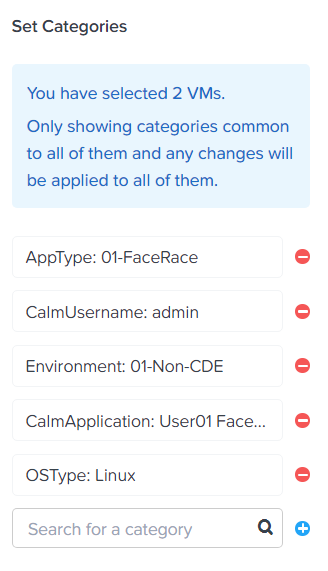
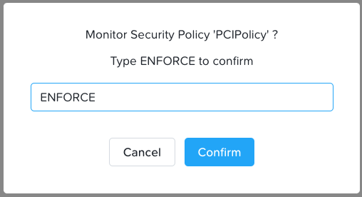

.. _detect_isolate:

------------------------------------------------
Isolate Environments
------------------------------------------------

Isolating Environments
++++++++++++++++++++++++

Our FaceRace gaming machine is now properly secured from network activity outside the cluster, but to further ensure that we can’t access these machines from another VM from within the cluster we can provide Isolation Policies to all the VMs in our environment to create separation between virtual entities. 

This separation could be to ensure isolation between Development and Production VMs, or in our case, isolation between the Cardholder Data Environment (CDE) and the non-CDE (i.e. everything else!). 

Using the same method we used earlier we’re going to create some environments to delineate between entities that are part of the scope for a PCI assessment, namely this gaming application: 

Like in the last section, here we will add two more environmental Categories: **CDE & Non-CDE**

#. In **Prism Central**, select :fa:`bars` **> Virtual Infrastructure > Categories**.
#. Select **Environment > Actions > Update**.
#. Under **Values** and using your **User##**, create **##-CDE** and **##-Non-CDE**.

   .. figure:: images/envcat.png

#. Click **Save**.

Now we need to assign the CDE category value to the **User##-Prod-FaceRace** VMs and the Non-CDE category value to EVERYTHING else.

#. In **Prism Central**, select :fa:`bars` **> Virtual Infrastructure > VMs**.
#. Select **both** **User##-Prod-FaceRace-Web** and **User##-Prod-FaceRace-DB** that support our gaming application and click **Actions > Manage Categories**. 
#. In the search box type **Environment:##-CDE**.  (Use your User Number)
#. Click **Save**.

   .. figure:: images/cdecat01.png

   .. note::

      Normally we would create the inverse category value to assign to all other (Non-CDE) VMs within the environment. But for the purposes of this exercise, we will only add the **User##-Dev-FaceRace** and go straight to policy creation. 

#. In **Prism Central**, select :fa:`bars` **> Virtual Infrastructure > VMs**.
#. Select **both** **User##-Dev-FaceRace-Web** and **User##-Dev-FaceRace-DB** that support the development of our gaming application and click **Actions > Manage Categories**. 
#. In the search box type **Environment:##-Non-CDE**.  (Use your User Number)
#. Click **Save**.

Now that category values have been created and appropriately assigned to the VM’s we can create an Environment/Isolation policy. 

#. Go to **Prism Central**, select :fa:`bars` **> Policies > Security**.
#. Create **Security Policy**.
#. Click the radio button next to **Isolate Environments (Isolation Policy) > Create**.
#. In the fields enter the following information: 

- Name = User##-PCIPolicy
- Purpose = Isolate the CDE from the Non-CDE
- Isolate this category = Environment:CDE
- From this category = Environment:Non-CDE

#. Click **Save and Monitor**.

   .. figure:: images/pci.png

   .. note::

      We don’t need to apply the isolation only with a subset of the data center, nor do we need to enable Policy Hitlogs for this policy at this time. 

When Enforced, this type of policy is a simple and effective way to achieve the desired isolation between sensitive environments that might contain Personal customer data, or for the creation of network security best practices i.e. creating a DMZ, or Honeypots. 

Testing the Isolation Policy
+++++++++++++++++++++++++++++

Just like we did during our **Security Policy** testing, we will **Enforce** the new **Isolation Policy** and check if it is working.

#. To enforce the **Isolation Policy** we created, select :fa:`bars` **> Policies > Security** and select your **User##-PCIPolicy**.
#. You'll notice that **Flow** is observing the traffic between the VMs in the policy.
#. To start blocking traffic and making this isolation policy work, click **Enforce**, in the upper-right corner of your screen.

#. Type **ENFORCE** and click **Confirm**.

#. Similar to the previous steps, in **Prism Central**, select :fa:`bars` **> Virtual Infrastructure > VM**.
#. Go to your **User##-Prod-FaceRace-DB**, right-click and select **Launch Console**.
#. Use **username: centos** and **password: nutanix/4u** to logon.
#. If you have stopped the pings from last exercise, start another ping to your **User##-Dev-FaceRace-DB** VM IP.
#. Notice the pings will fail this time around, as we are blocking Production environment from Development (and potentially everything else).

**Congratulations for going above and beyond and isolate your production application environment.**