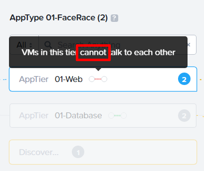
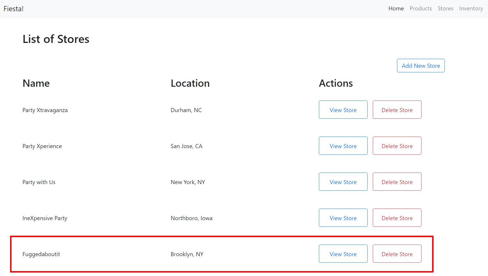

.. _detect_security:

----------------------
Securing Applications
----------------------

Security Policy Creation
+++++++++++++++++++++++++

Now that we’ve defined some Categories and assigned them to the respective VM’s we can begin to use those categories to form Security Policies that will be used to isolate traffic to and from these VM’s. This capability is part of Flow micro-segmentation. 

Flow is an application-centric network security product tightly integrated into Nutanix AHV and Prism Central. Flow provides rich network traffic visualization, automation, and security for VMs running on AHV.

Microsegmentation is a component of Flow that uses simple policy-based management to secure VM networking. Using Prism Central categories (logical groups), you can create a powerful distributed firewall. Combining this with Calm allows automated deployment of applications that are secured as they are created.

#. In **Prism Central**, select :fa:`bars` **> Policies > Security**
#. Click **Create Security Policy > Secure Applications (App Policy) > Create**.
#. Fill out the following fields:

- Name - User##-FaceRace
- Purpose - Restrict unnecessary access to the FaceRace gaming machines
- Secure this app - start typing your *##* and look for **User##-FaceRace**

   .. figure:: images/appsec01.png

#. Click **Next**.

   .. note::
      If prompted, click OK, Got it! on the tutorial diagram of the Create App Security Policy wizard.

#. To allow for a more granular configuration of the security policy, click **Set rules on App Tiers** instead, rather than applying the same rules to all components of the application.

   .. figure:: images/apptierrules.png

#. Select **Web** from the drop-down.
#. Select **DataBase** from the drop-down.

   .. figure:: images/apptiers.png

Next, you will define the Inbound rules, which control which sources you will allow to communicate with the FaceRace application VMs. You can allow all inbound traffic, or define whitelisted sources. By default, the security policy is set to deny all incoming traffic.

In this scenario, we want to allow inbound TCP traffic to the FaceRace web tier on TCP port 80 from all clients.

#. Under **Inbound**, click **+ Add Source**.
#. Fill out the following fields to allow all inbound IP addresses:

- Add source by: - Select Subnet/IP
- Specify 0.0.0.0/0

#. Click **Add**.

   .. note::
      Sources can also be specified by Categories, allowing for greater flexibility as this data can follow a VM regardless of changes to its network location.

#. To create an inbound rule, select the **+ icon** that appears to the left of **AppTier:Web**.
#. Choose Select a Service.
#. Fill out the following fields:

- Protocol/Service - TCP
- Ports/Service Details - 80

   .. figure:: images/inbound.png

   .. note::
      Multiple protocols and ports can be added to a single rule.

#. Click **Save**.
#. Under **Inbound**, click **+ Add Source**.
#. Fill out the following fields:

- Add source by: - Select Subnet/IP
- Specify Your Prism Central IP/32

   .. note::
      The /32 denotes a single IP as opposed to a subnet range.

#. Click **Add**.
#. Select the **+ icon** that appears to the left of **AppTier:Web**, specify **TCP port 22** and click **Save**.
#. Repeat previous step for **AppTier:Database** to allow communication with the database VM.

   .. figure:: images/tierconfig.png

By default, the security policy allows the application to send all outbound traffic to any destination. The only outbound communication required for your application is to communicate with your DNS server.

#. Under **Outbound**, select **Allowed List Only** from the drop-down menu, and click **+ Add Destination**.
#. Fill out the following fields:

- Add source by: - Select Subnet/IP
- Specify Your Domain Controller IP/32

   .. figure:: images/domainip.png

#. Click Add.
#. Select the **+ icon** that appears to the right of **AppTier:Web**, specify **UDP port 53** and click **Save** to allow DNS traffic. 
#. Repeat this for **AppTier:Database**.

   .. figure:: images/tierconfig02.png

Each tier of the application communicates with other tiers and the policy must allow this traffic. Some tiers such as the Web tier do not require communication within the same tier.

#. To define intra-app communication, click **Set Rules within the App**.

   .. figure:: images/withinapp.png

#. Click **AppTier:Web > Edit** and select **No** to prevent communication between VMs in this tier. There are only two VMs (Prod and Dev) within the tier currently but scale-out operations will apply this policy to all VMs in this category preventing their ability to communicate with one another. **True Micro-segmentation!**
#. While **AppTier:Web** is still selected, click the **+ icon** to the right of **AppTier:DB** to create a tier-to-tier rule.
#. Fill out the following fields to allow communication on **TCP port 3306** between the web and database tiers:

- Protocol - TCP
- Ports - 3306

   .. figure:: images/tiertotier.png

#. Click **Save**.
#. Click **Next** to review the security policy.
#. Click **Save and Monitor** to save the policy.

   .. figure:: images/save.png

Testing Security Policy
+++++++++++++++++++++++++

Now that we have created our first security policy, we need to test it.
Note that we configured our policy in **Monitor** mode, which means that we are not yet enforcing any Inbound and Outbound traffic.

#. In **Prism Central**, select :fa:`bars` **> Virtual Infrastructure > VM**.
#. Go to your **User##-Prod-FaceRace-Web**, right-click and select **Launch Console**.
#. Use **username: centos** and **password: nutanix/4u** to logon.
#. Start a ping to your **User##-Dev-FaceRace-Web** VM IP.

#. Similar to the previous steps, in **Prism Central**, select :fa:`bars` **> Virtual Infrastructure > VM**.
#. Go to your **User##-Prod-FaceRace-DB**, right-click and select **Launch Console**.
#. Use **username: centos** and **password: nutanix/4u** to logon.
#. Start a ping to your **User##-Dev-FaceRace-DB** VM IP.

#. To enforce the Security Policy we created, select :fa:`bars` **> Policies > Security** and select your **User##-FaceRace**.
#. You'll notice that **Flow** is observing the traffic between the VMs in the policy.

.. figure:: images/monitor.png

#. Within your **AppType ##-FaceRace**, hover the mouse cursor over the dotted line between two circles and see how you configured the communication within the application tiers.

.. note:: 
   If you click **Discovered**, immediately bellow the **Database** tier, you'll see the traffic of those pings you started.

   .. figure:: images/blocked.png

#. To start blocking traffic and making this security policy work, click **Enforce**, in the upper-right corner of your screen.

.. figure:: images/enforce01.png

#. Type **ENFORCE** and click **Confirm**.

.. figure:: images/enforce02.png

#. Now, go back to the **Console** of the VMs (**User##-Prod-FaceRace-Web** and **User##-Prod-FaceRace-DB**) you started the pings.
#. You should notice that, while **User##-Prod-FaceRace-Web** cannot ping **User##-Dev-FaceRace-Web**, **User##-Prod-FaceRace-DB** can ping **User##-Dev-FaceRace-DB**. Just like you configured

Another way to test if the application is working properly is to open a browser and test its functionality.

#. Get the IP of your **User##-Prod-FaceRace-Web** by going to **Prism Central**, select :fa:`bars` **> Virtual Infrastructure > VM**.
#. Open a browser tab and type **User##-Prod-FaceRace-Web**'s IP Address.

#. Select **Stores**.
#. Click **Add New Store**.

#. Fill out the information and click **Submit**.
#. Check if your store was created, confirm that your application is working as expected.

**Congratulations, your Security Policy is working to restrict the required traffic to the VMs supporting FaceRace app.**