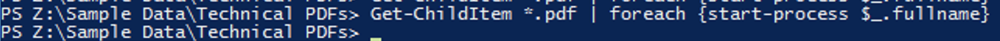

.. _detect_fa:

------------------------------------------------
Files Analytics
------------------------------------------------

Defining Anomalies
++++++++++++++++++++

#. In **Prism Central**, select :fa:`bars` **> Services > Files > click on File Servers**
#. Click on **Manage** in the **Actions** column from the File Server **TheRocketFS** 

   .. figure:: images/manage.png

A new window will appear sending you to **Prism Element**

#. Click on **TheRocketFS** and select **File Analytics** from the menu

   .. figure:: images/fa01.png

Your Files Analytics Dashboard will show metrics like Top 5 active users, Top 5 accessed files and File Operations

   .. figure:: images/fa02.png

While in your environment everything looks normal, those widgets are essential to detect unusual or anomalous behavior – such as repeated failed authentications, an increase in network traffic, or a large volume of file updates and touchpoints.

Let’s create an Anomaly Rule to detect suspicious activity based on action

#. Click on the **gear icon** on the upper-right > **Define Anomaly Rules**

   .. figure:: images/anomalyrules.png

#. Click on **+ Configure new anomaly**, with the following information:

   - In Events, select Rename
   - Minimum Operation % 10
   - Minimum Operation Count 50
   - User All Users
   - Select Hourly
   - Interval 1

   Alternatively, you can send an Anomaly Alert to one or more email addresses

#. Click Check Mark, and then Save.

   .. figure:: images/defineanomaly.png

   .. note::
      This is a one time configuration, if you see this step already performed, that means that you are sharing your cluster with someone who has gone through it already so just skip to the next step.

In this step we are mimicking what an attack or deliberately mean behavior should look like. Examples are a malicious script repeatedly accessing data or someone trying to steal multiple files, private information from the company.

Now, let’s generate activity on the File Server, you will be required to connect to your **##-WinTools VM** via RDP (preferred) or console, using NTNXLAB\\adminuser## (from the :ref:`prevent_auth_dirservices` step) **pass: nutanix/4u**. You can check its IP by going to **Compute & Storage > VMs > User##-WinTools VM IP column**.

Once you connect to your **##WinTools VM**, ensure that you have mapped out **TheRocketFS** File Server to **drive Z:**
If not mapped, open **Windows Explorer**, right click on **Computer > Map Network Drive > \\\\TheRocketFS.ntnxlab.local\\User##-FaceRace**

   .. figure:: images/winmap.png

#. First, download the `Sample Data <https://peerresources.blob.core.windows.net/sample-data/SampleData_Small.zip>`_ and extract it to your newly mapped **Z: Drive**.

#. Open **PowerShell** console and navigate to:

.. code-block::

   Z:\Sample Data_Small\Sample Data\Technical PDFs 

#. Run the following command:

.. code-block:: PowerShell

   Get-ChildItem *.pdf | foreach {start-process $_.fullname}

Notice that your WinTools VM will open almost 100 pdf files at once.

   .. figure:: images/pdf.png

Now, let's go back to File Analytics, :fa:`bars` **> Audit Trails**.

#. Check **Users** and search for **adminuser##**
#. Under **Action** column, select **Audit Trail**
#. In Filter by **Operations**, select **Read**, and then click **Apply**.

   .. figure:: images/audit.png

Since you define such behavior as an Anomaly, if you go back to the Files Analytics menu, you should see a warning message under Anomalies Alerts

   .. figure:: images/anomalerts.png

   .. warning::
      It takes 1 hour for the Anomaly scan to work, you might want to finish the next section and come back here

Go to :fa:`bars` **> Anomalies** and check the in-depth **Anomaly** report

   .. figure:: images/anomareport.png

   .. note::
      This is the exact expected behavior when your environment is being attacked and File Analytics helps identify Anomaly trends in your environment.
