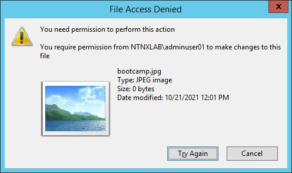

.. _detect_faransom:

------------------------------------------------
File Analytics Ransomware Protection
------------------------------------------------
Starting in AOS 5.19 and FA 3.0, you can enable Ransomware protection on FA

File Analytics scans files for ransomware in real-time and notifies you through email in the event of a ransomware attack. By using the Nutanix Files file blocking mechanism, File Analytics prevents files with signatures of potential ransomware from carrying out malicious operations. Ransomware protection automatically scans for ransomware based on a curated list of signatures that frequently appear in ransomware files. You can modify the list by manually adding other signatures.

File Analytics also monitors shares for self-service restore (SSR) policies and identifies shares that do not have SSR enabled in the ransomware dashboard. You can enable SSR through the ransomware dashboard by selecting shares identified by File Analytics.

Enabling Ransomware Protection
+++++++++++++++++++++++++++++++

#. To Enable Ransomware Protection, click :fa:`bars` **> Ransomware**

   .. figure:: images/enable.png

#. Click **Enable Ransomware Protection**, and then click **Enable**.

   .. figure:: images/enable2.png

   .. note::

      This is also a one-time setting, meaning that if you see that Ransomware Protection is enabled, you can review the options but no action is required.

Optionally, you can add an email address to receive notifications

#. Click Download (.CSV) to learn more about which file extensions FA will start blocking

   .. figure:: images/csv.png

   .. note::

      This feature leverages the underlying Nutanix Files capability to block certain extensions, you can overwrite this setting by going back to **File Server > Share/Export >** click the share you’d like to change and select **Update**. The Update a share/export wizard will open, **click next**, check **Block File Types**, and customize with whichever file types you need. 
      This operation will **override** the File Server settings, in the illustrative case below, it is **only blocking** files with **.matt extension**, ignoring the Ransomware Protection. 

      .. figure:: images/matt.png

      This is **informational only** - don’t change the default Blocked File Types or the rest of the lab won’t work as desired.
 
 
#. Back to your **User##-WinTools** VM, using your NTNXLAB\adminuser##, open folder **Z:\Sample Data_Small\Sample Data\Documents** and create a .txt file
#. Rename to Bootcamp.txt
#. Rename it again, changing only the extension to Bootcamp**.jpg**

#. Once again, try to change the extension to Bootcamp**.Valley** (which is one of the blocked extensions by Ransomware Protection)

#. Go back to the FA UI and click **Ransomware**

#. Check that the Vulnerability section has been updated with the recent malicious attempts of creating a **.Valley** file.

.. figure:: images/attempt01.png

Custom Reports
+++++++++++++++

Now, let’s explore how to build a report in Files Analytics:

#. Click on the :fa:`bars` **> Reports > Create a new report**
#. Select **Pre-canned Report Templates**
#. Based on **Events**
#. Under **Define Filters**, choose **Permission Denied {File Blocking} Events**
#. Click on **Run Preview**

   .. figure:: images/preview.png

   .. note::

      Feel free to customize and explore the reports in other ways, in this example we are targeting the actions that resulted in preventing a user (or script) from altering the file in a malicious way.
