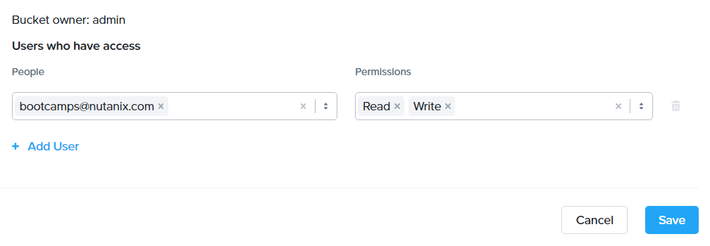
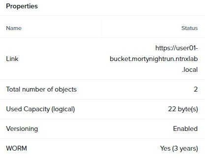

.. _detect_objects:

------------------------------------------------
Nutanix Objects
------------------------------------------------

Configuring WORM
+++++++++++++++++

You know the storage administrators for **Blips and Chitz** have created an object storage for **Mortynight Run**, the video surveillance system, and it needs archive data for regulatory purposes and improved security.
Your task will be to guarantee that the policies set for the repository are following your security guidelines.

Create Bucket In Prism
+++++++++++++++++++++++

A bucket is a repository within an object store that can have policies applied to it, such as versioning, WORM (Write Once, Read Many), etc. By default, a newly created bucket is a private resource to the creator. The creator of the bucket by default has read/write permissions and can grant permissions to other users.

#. Go to Prism Central :fa:`bars` **> Services > Objects**
#. Click on the existing **Object Store (mortynightrun)** to manage it.
#. Check the existing **user##-bucket** and click **Actions > Configure WORM** to view its settings

   .. figure:: images/worm.png

You realize your colleagues didn’t enable **WORM** and **Expiration** settings, so you have to do it yourself to protect the company’s data from attackers and for audit purposes.

#. Click **Enable Version**.
#. Click **Enable WORM** and set the **Retention Period** to 3 years.
#. Click **Enable WORM** to save the changes.

   .. figure:: images/enableworm.png

#. Go back to **Object Store landing page** and click on your bucket (**user##-bucket**) and select **Lifecycle** on the left-side menu.

   .. figure:: images/createrule.png

#. Click **Create Rule** and set the following parameteres:
   Name: User##-Expiration Rule 
   Scope: All Objects
#. Then, click next and check **Expiration**.
#. Set Expire **Curent Version** to **3 years**.

   .. figure:: images/exp.png

   .. note::

      You can configure WORM and Expire settings to align with your company’s security policy.
      After you commit to the WORM configuration, you will have a 24-hour grace period window where you can disable its settings, after 24 hours you can no longer change it and the system will follow this behavior. Not even Nutanix support can modify it.

#. Click **Next** and **Done**.

   .. note::

      WORM storage prevents the editing, overwriting, renaming, or deleting of data and is crucial in heavily regulated industries (finance, healthcare, public agencies, etc.) where sensitive data is collected and stored. Examples include emails, account information, voice mails, and more.
      Note that if WORM is enabled on the bucket, this will supersede any lifecycle expiration policy, in this case, you set it to 3 years.

   .. note::

      Tiering allows for infrequently used objects to be moved to the configured endpoints according to the configured lifecycle rule for tiering. The supported endpoints are AWS S3 and a different Objects instance.

User Management
++++++++++++++++

In this exercise, you will generate access and secret keys to access the object store that will be used throughout the lab.

#. In **Prism Central**, select :fa:`bars` **> Services > Objects**.
#. Click on **Access Keys** and click **Add People**.

   .. figure:: images/addpeople03.png

#. Select **Add people not in a directory service** and enter your e-mail address.

   .. figure:: images/addpeople.png

#. Click **Next**.
#. Click **Generate Keys** to generate a key.

   .. figure:: images/addpeople02.png

#. Click **Download Keys** to download a .txt file containing the **Access Key and Secret Key**.

   .. figure:: images/addpeople04.png

#. Click **Close**.

#. Open the file with a text editor.

   .. figure:: images/keys.png

.. note::

   Keep the text files open so that you have the access and secret keys readily available for future labs.

.. warning:: 

   INFORMATIONAL ONLY - NO NEED TO TAKE ACTION.

   For security audits, you can revoke or renew access keys.
   #. Click on the **Access Keys** again

   .. figure:: images/revoke01.png

   #. Select your user and click **Manage** on the far right side
   #. You can select **+ Add Key** to generate a new **Access Key** to this user or select its **Access Key** displayed and **revoke** access by clicking on the **Delete** button.

.. figure:: images/keys02.png

 
Adding Users to buckets_share
++++++++++++++++++++++++++++++

#. From the **Objects UI**, click on **Object Stores**.
#. Within the **Object Store list**, click **mortynightrun**.
#. Check the box next to your **user##-bucket bucket**, and click **Share** from the **Actions** dropdown.

This is where you will be able to share your bucket with other users. You can configure read access (download), write access (upload), or both, on a per user 
basis.

#. Select the user you created earlier, with **Read and Write** permissions.
#. Click **Save**.

Accessing & Creating Buckets With Objects Browser
++++++++++++++++++++++++++++++++++++++++++++++++++

In this exercise, you will use **Objects Browser** to create and use buckets in the object store using your generated access key.

#. Click `here <https://s3.amazonaws.com/get-ahv-images/sample-pictures.zip>`_ to download the sample images to your local computer. Once the download is complete, extract the contents of the .zip file.

#. From the **Objects UI**, Locate the **Objects Public IPs**.

#. In a new browser tab paste the **Objects Public IP**, and add **port 7200**.

#. Enter the following fields for the user-created earlier, located in the .txt file, and click the Login button:

   - Access Key - **Generated When User Created**
   - Secret Key - **Generated When User Created**

#. Click the **+ icon** and **Upload File**.
#. Navigate to the directory where you extracted the sample pictures, and upload one picture to your bucket. You may optionally repeat this process to upload multiple pictures.

.. figure:: images/explorer.png

Nutanix provides an intuitive interface to manage your object storage buckets and that is how easy it is to use the Objects Browser.

Object Versioning
++++++++++++++++++

Object versioning allows the upload of new versions of the same object for required changes, without losing the original data. Versioning can be used to preserve, retrieve and restore every version of every object stored within a bucket, allowing for easy recovery from unintended user action and application failures.

#. Open **Notepad** on your local machine.
#. Type “version 1.0” in Notepad, then save the file as UserXX.txt.
#. In **Objects Browser**, upload the text file to your **user##-bucket** bucket.
#. Make changes to the text file in Notepad and save it with the same name, **overwriting** the original file.
#. Upload the **modified file** to your bucket. If desired, you can update and upload the file multiple times.
#. Back on the **Objects UI**, click on the **mortynightrun** Object Store.
#. Look at the **Num. Objects** column for your **user##-bucket** bucket.

.. note::

      You will see that there is an Object counted for every version of your test file. In the example above, I had three different files (two pictures and one text file) but within the text file, I have three different versions of it. Essentially, by keeping multiple versions of the same file, Nutanix Objects makes it possible to restore old versions at any point in time.
      S3 compatible third-party tools can access previous versions of any given file for restoring purposes.

Since you chose Nutanix as your cloud provider, you now have a lot more time to do things you couldn’t before because you had to spend so much time operationalizing everything. It’s already Pub Time and you can safely get away from your desk for a couple of hours.