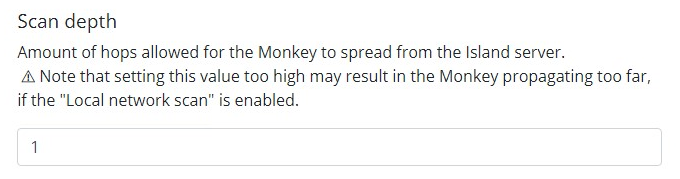

.. _detect_im:

------------------------------------------------
Simulating an attack 
------------------------------------------------

.. raw:: html

   <strong>This lab is supposed to be an Intructor-led exercise and should be planned in advance to integrate with Flow Security Policies to show traffic discovered before and after Enforcing the Flow Policies.</strong>

Infection Monkey
+++++++++++++++++

You’re impressed so far, but like the old Russian proverb states, “Trust but verify.” How can you simulate an attack against Blips and Chitz? You don’t have the necessary experience to conduct a penetration test yourself, so you go about trying to find a tool that can simulate an Advanced Persistent Threat (APT). 

Infection Monkey, by Guardicore, is a tool that can be used to simulate and automate many of the actions of a penetration test. Obviously, penetration tests by skilled professionals are more thorough and accurate, but for the purposes of trying to expose potential critical vulnerabilities in this new system, it is likely a good tool to use.

What is Infection Monkey
+++++++++++++++++++++++++

Infection Monkey is an open source breach and attack simulation (BAS) platform that allows you to discover security gaps and fix them. The Monkey uses various methods to self propagate across a data center and reports success to a centralized Monkey Island server. With Infection Monkey, you can simulate credential theft, compromised machines, and other security flaws, and mimic the what is commonly observed in Ransomware attacks, albeit non- destructively. Infection Monkey is executed from a user-friendly, web-based GUI.

The Infection Monkey is comprised of two parts:
   - Monkey - A tool which infects other machines and propagates to them.
   - Monkey Island - A dedicated server to control and visualize the Infection Monkey's progress inside the data center.

Installing Infection Monkey in your HPOC lab
+++++++++++++++++++++++++++++++++++++++++++++

#. Connect to **InfectionMonkey** VM using RDP or VM Console

The Infection Monkey software package and required Microsoft Visual C++ package are found bellow:

`http://10.42.194.11/workshop_staging/InfectionMonkey/`

 
#. You will first install the Microsoft Visual C++ package, named: **VC_redist.x64**. This package is required for IFMonkey and must be installed prior to installing IFMonkey

   .. figure:: images/image002.png

#. The installation is a simple **RUN**, then agree to License terms and click **Install**. 

.. figure:: images/image006.png

#. Return to the **shared folder** and run the **InfectionMonkey** install. The Infection Monkey install will take a few minutes

Once completed you will be prompted to Launch Infection Monkey and create a Desktop Shortcut

#. When launching **Infection Monkey**, 2 terminal screens will open. These terminal sessions are for the **MongoDB** instance and **Command** and **Control Server** used by **Infection Monkey**. The terminal sessions need **no input** from you and can be minimized **(do not close)**.

#. You will also have a Chrome Browser session launch. This is session **will initially timeout**. No need to worry. It takes a **few minutes** for the Mongo DB and C&C Server to come up. Once they are ready, you can **refresh** and continue.

#. When connecting to the web interface for the first time, you will have an option to setup a username and password or continue without a username/password. **It is suggested that the lab administrator (you) create this unique username and password set**.

Configure Infection Monkey
+++++++++++++++++++++++++++

#. Open you browser and type **localhost:5000**. 

#. Then, select the **Network Tab**.

#. Set the Infection Monkey **Scan depth** to **1**. This will prevent Infection Monkey from scanning subnets and host outside of the local subnet.

#. Set your **Scan Target** to the subnet of your HPOC environment

#. Once completed, hit **Submit** at the bottom of the page

 
This will provide enough configuration to get going. Feel free to explore the exploits that will be run, **add any username and passwords** to the **Credentials** section under the **Exploits** tab, add a drop file or command in the **Monkey** tab. There are many options to customize the configuration.

Run Infection Monkey
+++++++++++++++++++++

#. On the initial screen, select **Run Monkey**.

#. Click on **Run on Monkey Island Server**.

   .. figure:: images/image021.png

   .. note::
      You have the option to select a machine of your choice-this is a great option after you have kicked off the initial run of Infection Monkey. This will give you the ability to exploit and control additional Infection Monkeys remotely

View the Infection Map and Security Reports
++++++++++++++++++++++++++++++++++++++++++++

#. Give the Infection Monkey **5-10 minutes** to start discovering machines on the network. 
#. Then, select **Infection Map**. The Infection Map will provide a visual map of the discovered machines,expoloits etc.. It is very telling. You can also view the **Security Reports** while it is running, but I suggest waiting until the scan has completed. This will provide more complete information on the findings.

Conclusion
++++++++++

   - Once completed with the initial runs of **Infection Monkey**, create a **Flow Security Policy** to lock down your application. Then, **rerun** Infection Monkey to determine weather your security policy is now preventing Infection Monkey from discovering and exploiting your VMs protected by the Security Policy. 
