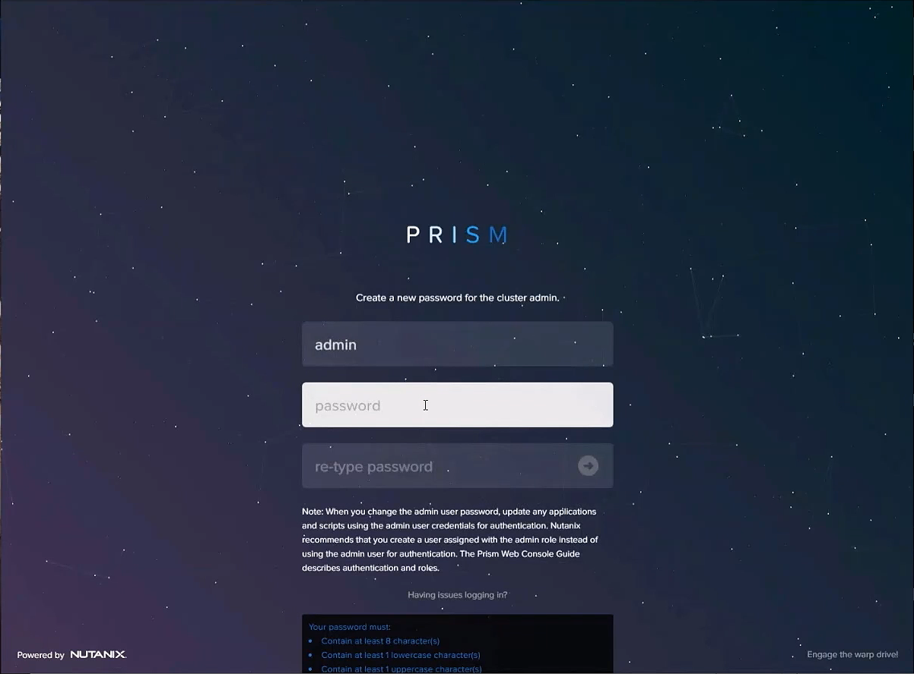
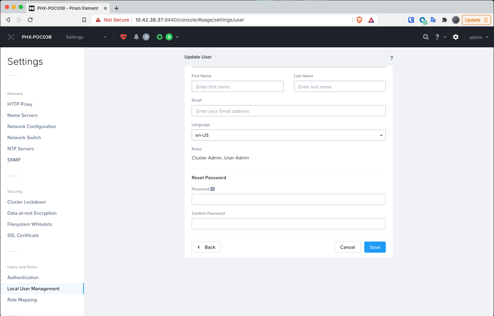
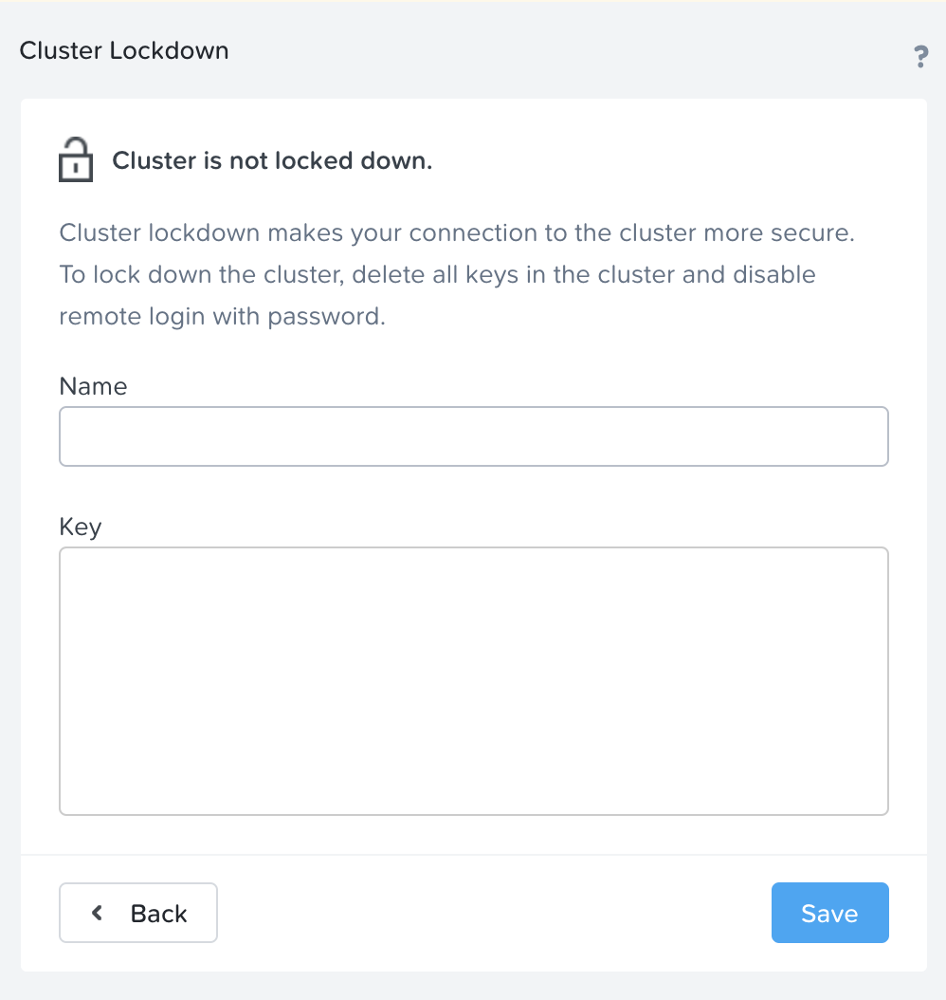
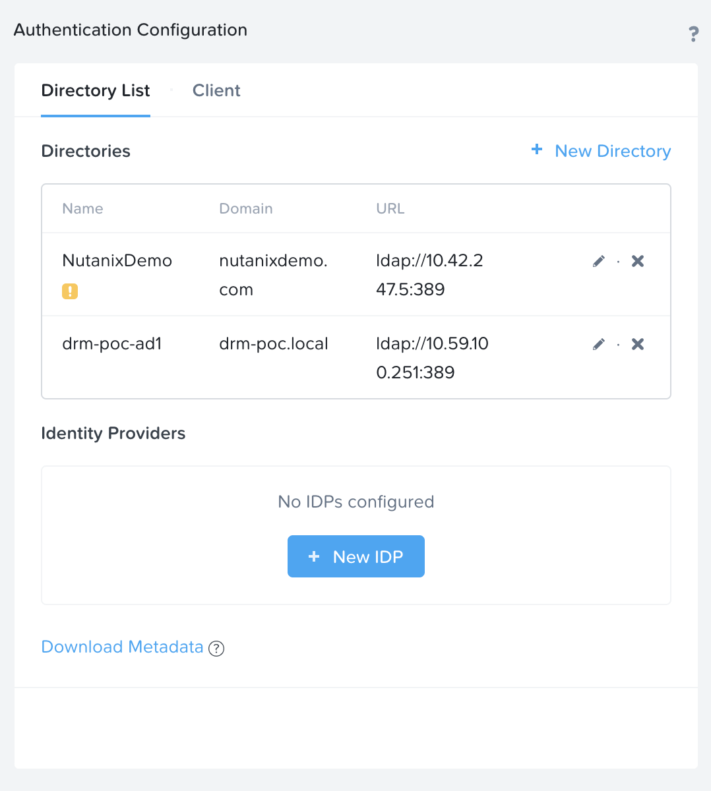
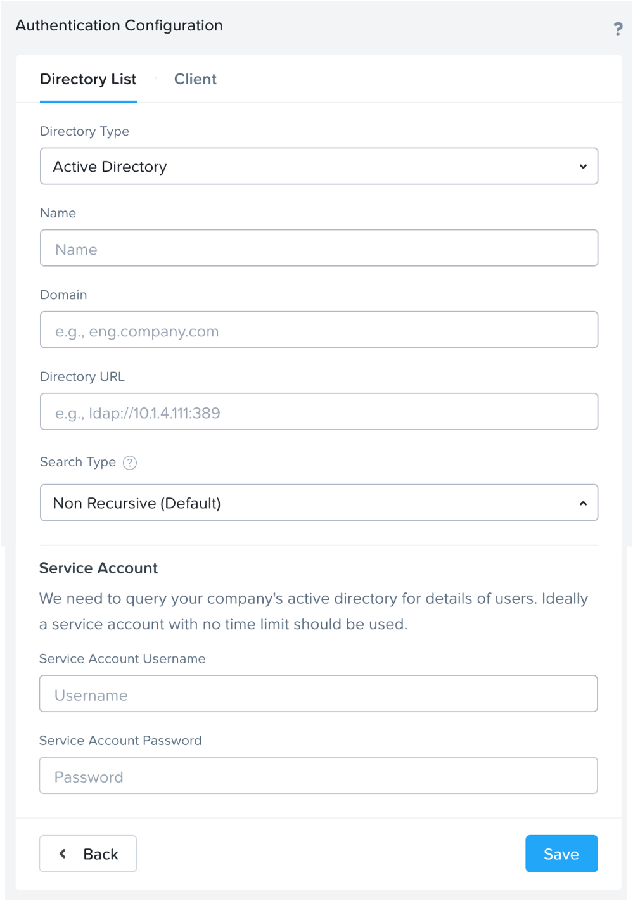

.. _prevent_auth:

------------------------------------------------
Authentication
------------------------------------------------

Changing vendor default PWs & Cluster Lockdown:
+++++++++++++

(INFORMATIONAL - DONT DO THESES STEPS IF YOU USING HPOC)

Changing vendor default passwords is an essential first step in the adoption of new platforms and often tested and measured in many compliance assessments. Failure to address this early critical step in system configuration can result in effectively leaving an open door to an attacker. 

In a Nutanix deployment, there are several default passwords that need to be addressed. The first of which, Prism,  is something you will be presented with and is quite simple. After the foundation process is complete you will be encouraged to open Prism Element. This first log-in event will ask you to create a new password for Prism access. This new password is attached to a local account. 

Changing Prism Password
++++++++++++++

The first task you will complete with your newly installed Nutanix cluster is changing the default password for Prism Element, the cluster management interface for Nutanix. 

Upon first logging into Prism after Foundation has completed, you will specify the Prism password for the “admin” user account. 

To change Prism passwords again, or add more local user accounts to Prism you should visit Users and Roles in Prism settings:

Here you can reset any password for any local account and even change authentication from Local to a Directory Service. 

Changing AHV password
+++++++++++++

(INFORMATIONAL - DONT DO THESES STEPS IF YOU USING HPOC)

Next up we need to address the default settings for the system hypervisor, AHV. AHV is protected with a local account, with credentials hashed and salted for further protection from potential brute force or dictionary attacks. To change the default password for AHV you will need to use the Command Line Interface (aCLI). 

First, log on to the AHV host (IP address) via SSH:
ssh nutanix@10.x.x.x 

Use the password: nutanix/4u To Change the root password type:
passwd root

Respond to the prompts, providing the current and new root password.
Changing password for root.
New password:
Retype new password:

You should see a message confirming the password has been changed:
passwd: all authentication tokens updated successfully.
Repeat these steps on every AHV host in the cluster.
Tip: Although it is not required for the root user to have the same password on all hosts, doing so makes cluster management and support much easier. If you do select a different password for one or more hosts, make sure to note the password for each host.

Changing CVM Passwords
+++++++++++++

(INFORMATIONAL - DONT DO THESES STEPS IF YOU USING HPOC)

By default, there are two local accounts present at the time of deployment of your cluster. We have the Nutanix user, and the Admin user. 

To change the Nutanix user password, first, you must SSH to the CVM as the nutanix user: 
ssh nutanix@10.x.x.x

Next,change the account password following the corresponding prompts when they appear:
nutanix@cvm$ passwd

Changing password for nutanix.
Old Password:
New Password:
Retype new password:
Password Changed.

To change the Admin user password, first you must SSH to the CVM as the admin user: 
ssh admin@10.x.x.x

Next, change the account password following the corresponding prompts when they appear:
admin@cvm$ passwd

Changing password for admin.
Old Password:
New Password:
Retype new password:
Password Changed.

Note: The password must meet the following complexity requirements: 
At least 8 characters long
At least 1 lowercase letter
At least 1 uppercase letter
At least 1 numeric character
At least 1 special character
At least 4 characters different from the old password
Must not be among the last 5 passwords
Must not have more than 2 consecutive occurrences of a character
Must not be longer than 199 characters

Changing IPMI Password
+++++++++++++

(INFORMATIONAL - DONT DO THESES STEPS IF YOU USING HPOC)

The Intelligent Platform Management Interface (IPMI) is a way for remote administrators to ascertain the hardware state of the infrastructure Nutanix is running upon. 
With BMC 7.07 and earlier, IPMI credentials are; 
Username = ADMIN		Password = ADMIN
Note: For the process to change the IPMI password with earlier BMC versions, see below. 
In compliance with California statute SB-327, BMC 7.08 and later use a unique password. This new password Default IPMI credentials are;
 username = ADMIN		 Password = node-serial-number.
Finding the serial number
To find the serial number, issue the command
ipmitool fru print
from the host. In the output, search for Board serial. The Board serial value is the BMC password.
Restoring the IPMI password
If you set an IPMI password and then lose the new password, you can restore the password to the factory default with the following commands.
nutanix@cvm$ ipmicfg -fd
nutanix@cvm$ ipmitool raw 0x30 0x40
These commands reset the IPMI password to
node-serial-number
IPMI password criteria
• The required password length is 8 to 20 characters.
• You cannot set the password to be the reverse of the userid.
• The password must include characters from at least three of the allowed character classes: upper-case letters, lower-case letters, numerals 0 through 9, and special characters.
BMC 7.08 and later: 
Log on to a CVM in the cluster (using SSH) and first find the ID of the admin account in IPMI. To do this we run the following command:
hostssh "ipmitool user list"
After we got the ID of the ADMIN user, we can change the password by running the next command
hostssh "ipmitool user set password 2 <NEWPASSWORD>"
After you reset the password it is best practice to restart the BMC firmware, so the IPMI interface is restarted and all sessions are cleared.
hostssh "ipmitool mc reset cold"
By using the hostssh command the command will be triggered on ALL hosts in the cluster, so this saves already some time.

Cluster Lockdown
+++++++++++++

To further protect access to your cluster, introduce a layer of non-repudiation to your access method. With Cluster Lockdown you can replace SSH password-based authentication with a public SSH key. Only the holder of the corresponding private key will be able to login.

In Prism Element settings > Security > Cluster Lockdown 

You can then choose to add the new Public Key, give it a name and paste the public key in the field provided. 

Directory Services and Identity Providers
+++++++++++++

A local account is great for when you’re in a jam and need access when other authentication measures have failed, hence why this Local Admin user account should be protected via SSH keys rather than a password. For regular day-to-day access by team members and end-users, a more secure way to provide member access to Prism is with the use of Directory Services. No passwords or hashes are stored on the cluster for directory services users and authentication is passed through to the directory.

You can easily add details of your Directory in Prism, by navigating to Settings > Users & Roles > Authentication. 

As you can see from the image above, you can add a new Directory .. figure:: images/7.png

Then you will be able to enter the necessary information for connecting to Active Directory; 

As you may have noticed, In Prism Central if you visit the Authentication Configuration menu, you have the option to connect to an Identity Provider (IdP), this further enhances access protocols by leveraging technologies like Single Sign On (SSO) and Multi-Factor Authentication (MFA). 

Note: Currently Prism Central only supports ADFS as part of the SAML protocol. But you can register your appropriate account metadata in the same Authentication Configuration menu used above. 
