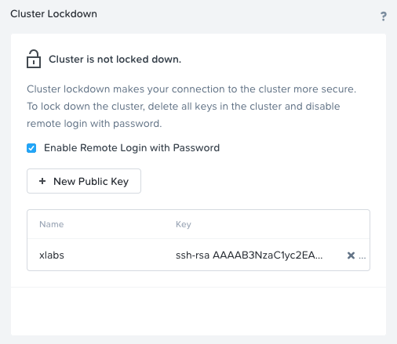

.. _prevent_auth:

------------------------------------------------
Authentication
------------------------------------------------

Changing vendor default PWs & Cluster Lockdown:
++++++++++++++++++++++++++++++++++++++++++++++++

Changing vendor default passwords is an essential first step in the adoption of new platforms and often tested and measured in many compliance assessments. Failure to address this early critical step in system configuration can result in effectively leaving an open door to an attacker. 

In a Nutanix deployment, there are several default passwords that need to be addressed. The first of which, Prism, is something you will be presented with and is quite simple. After the foundation process is complete you will be encouraged to open Prism Element. This first log-in event will ask you to create a new password for Prism access. This new password is attached to a local account. 

Next up we need to address the default settings for the system hypervisor, AHV. AHV is protected with a local account, with credentials hashed and salted for further protection from potential brute force or dictionary attacks.

With the CVM, by default, there are two local accounts present at the time of deployment of your cluster. We have the Nutanix user, and the Admin user. We'll change both passwords as well.

The Intelligent Platform Management Interface (IPMI) is a way for remote administrators to ascertain the hardware state of the infrastructure Nutanix is running upon.
In compliance with California statute SB-327, BMC 7.08 and later use a unique password. This new password Default IPMI credentials are:
username = ADMIN		Password = node-serial-number

Even though the Nutanix cluster you are using is dedicated to the Bootcamp, all of our automation is based on the current configured passwords. Changing those passwords will break our internal automation system so we'll provide you with a video describing the process. We do have the process documented, if you need to perform the steps showed bellow, let your instructor know.

.. raw:: html

   <strong>ADD CHANGING PASSWORDS VIDEOS HERE.</strong>  

Cluster Lockdown
+++++++++++++++++

To further protect access to your cluster, introduce a layer of non-repudiation to your access method. With Cluster Lockdown you can replace SSH password-based authentication with a public SSH key. Only the holder of the corresponding private key will be able to login.

   #. Log in **Prism Central (10.XX.XX.39)**, using user: admin (password provided by the instructor)
   #. Select :fa:`bars` **> Prism Central Settings > Security > Cluster Lockdown**

You can then choose to add the new Public Key, give it a name and paste the public key in the field provided. 

- Because this setting is a one-time configuration, we already provided a name and a public key. Feel free to explore its settings

Directory Services and Identity Providers
++++++++++++++++++++++++++++++++++++++++++

A local account is great for when you’re in a jam and need access when other authentication measures have failed, hence why this Local Admin user account should be protected via SSH keys rather than a password. For regular day-to-day access by team members and end-users, a more secure way to provide member access to Prism is with the use of Directory Services. No passwords or hashes are stored on the cluster for directory services users and authentication is passed through to the directory.

#. Select :fa:`bars` **> Prism Central Settings**.

#. Under **Users and Roles > Authentication**, click **+ New Directory**.

#. We have already provided an AutoAD as part of the Bootcamp, but feel free to understand what information you need to add you own AD.

   .. figure:: images/dirlist.png

   .. note::

      As you may have noticed, In Prism Central if you visit the Authentication Configuration menu, you have the option to connect to an Identity Provider (IdP), this further enhances access protocols by leveraging technologies like Single Sign On (SSO) and Multi-Factor Authentication (MFA). 

      Currently Prism Central only supports ADFS as part of the SAML protocol. But you can register your appropriate account metadata in the same Authentication Configuration menu used above. 

#. Click **Cancel**.

#. To complete Active Directory configuration, you must map AD users to Prism Central roles. Under **Users and Roles**, select **Role Mapping**, then click **+ New Mapping**.

#. Specify **adminuser##** account in Values. Choose the **Cluster Admin** role and click **Save**.

   .. figure:: images/rolemapping.png

   .. note::

      Each one of the participants are assign with a useradmin number provided by your instructor. Replace ## with your corresponding number.

#. Log out of Prism Central.

   .. figure:: images/signout.png

#. Log in as an AD user mapped in the previous step.

   .. note::

      You need to use the username@FQDN format when authenticating. Password is `nutanix/4u`.

   .. figure:: images/login.png

.. raw:: html

   <strong>From now on, you'll be using your assigned adminuser## (example: adminuser01). Failing to do so will impact how data is displayed during the rest of the labs</strong>  