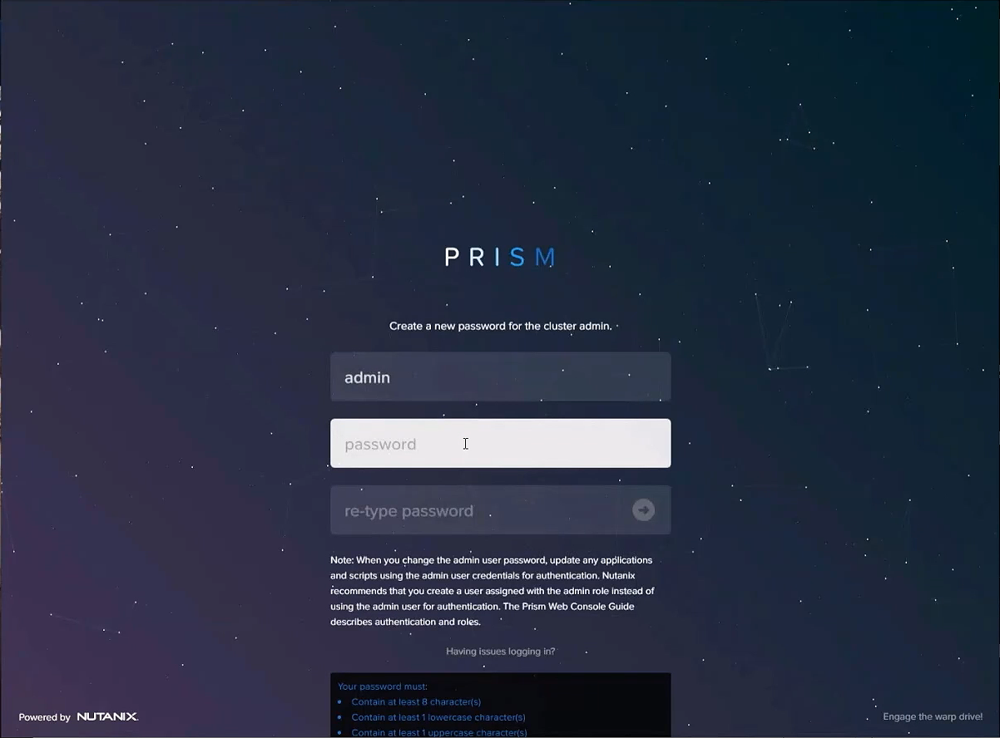
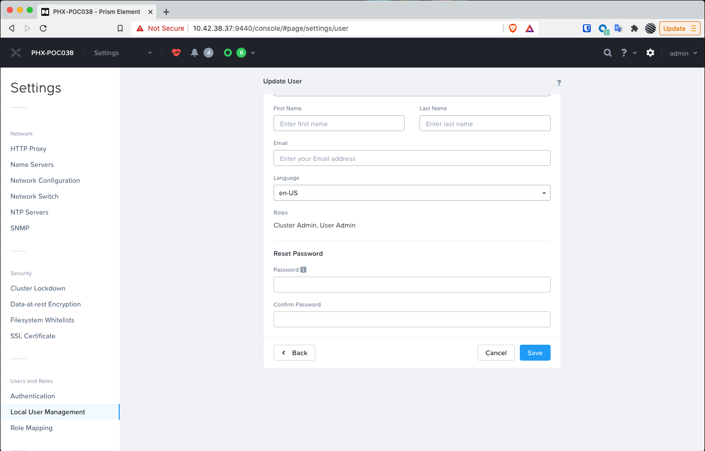

.. _prevent_stig:

------------------------------------------------
STIG
------------------------------------------------

Security is in our DNA at Nutanix. A significant proportion of our business is from sectors of industry that care deeply about security, including Federal Government, State Government, Local Government, Financial Services, Healthcare, Retail and more. This is why we build in security as an automated part of every configuration and deployment and by default it is on, and it is continuously monitored for compliance against the security baselines and Security Technical Implementation Guides. Unlike some vendors in the HCI space Nutanix doesn’t just have a single STIG, we apply multiple STIG’s, automatically, and continuously verify against them. But what is this STIG anyway?

The description of what STIG’s are is available on the Defense Information Systems Agency, Information Assurance Support Environment web site:

“The Security Technical Implementation Guides (STIGs) are the configuration standards for DOD IA and IA-enabled devices/systems. Since 1998, DISA has played a critical role enhancing the security posture of DoD’s security systems by providing the Security Technical Implementation Guides (STIGs). The STIGs contain technical guidance to “lock down” information systems/software that might otherwise be vulnerable to a malicious computer attack.”

STIG reports on Nutanix nodes
+++++++++++++
You can run a STIG report, which will check on all the STIGs and verify which are compliant with your system or not.
The steps to run the STIG report are as follows:
#. Connect to any Controller VM (CVM) as the nutanix user via SSH (Using Terminal, PuTTy, or similar program)
#. Change to the root directory of the CVM
   
   .. note:: 

   cd / 

#. List the files available to the root user within the /root directory. Executable files contain x in the permission string.
   
   .. note:: 

   sudo -u root ls -l /root

You should see a similar output:
   
   .. note::

   nutanix@NTNX-14SX35100046-A-CVM:10.21.71.29:~# sudo -u root ls -l /root
   total 248
   -rw-------. 1 root root   3314 Sep 11  2017 anaconda-ks.cfg
   drwxr-x---. 2 root root   4096 Dec 13 23:04 filesystems
   -rw-r-----. 1 root root   1132 May  3  2018 homeaudit.pp
   -rw-r-----. 1 root root   1231 May  3  2018 my-runcon.pp
   -rw-r-----. 1 root root    464 May  3  2018 my-runcon.te
   -rw-------. 1 root root   3222 Sep 11  2017 original-ks.cfg
   -rwxr-x---. 1 root root  10034 May  3  2018 report_open_jre8_stig.sh
   -rwx------. 1 root root 132760 Aug 30 23:50 report_stig.sh
   -rwxr-x---. 1 root root  72376 May  3  2018 report_web_stig.sh
   drwxr-x---. 2 root root   4096 Dec 13 23:17 sretools
   -rw-r-----. 1 root root    840 May  3  2018 sshdlocal.pp
   
There should be three .sh files that end in _stig.sh and the name corresponds to the output format. You’ll want to run the one that outputs in the format you prefer.
#. In this example, we’ll run the generic text output “report_stig.sh”

   .. note::
   sudo -u root ./root/report_stig.sh
 
The output will go into the root user log folder.

#. List the files in the folder and note the name of the report.

   .. note::
   sudo -u root ls -l /home/log | grep STIG

#. Copy the report to the nutanix home directory, substituting the actual file name for the asterisks.
      
   .. note::
   sudo -u root cp /home/log STIG-report-**-**-****-**-**-** /home/nutanix

#. List the files in the /home/nutanix folder.
      
   .. note::
   ls -l ~

#. Change the owner of the report file to be the Nutanix user, substituting the actual file name for the asterisks.
      
   .. note::
   sudo -u root chown nutanix:nutanix /home/nutanix/STIG-report-**-**-****-**-**-**

#. Use a secure copy tool (SCP, WINSCP, PSCP, etc) to copy the report results file to your workstation from the CVM.
   
   .. note::
   Note: Be sure to login to the CVM using the nutanix username and browse to its home directory to find the file we created above.

Analyzing the STIG Report
+++++++++++++

Obtain the STIG report generated in the previous step and use it to gather the current compliance state of the system.
You can leverage this report for validation and accreditation requirements for security compliance.
This will report the results of all elements that make up the Nutanix STIG, and the report will show the compliance result for each of the checks inside the STIG.
The first sentence says the check name
The second sentence is an explanation of the check
The third sentence is the legend for the result of the check
The fourth sentence is the result of the check
The fifth sentence is the completion status of the check
Examples results shown in the two checks below:
Example of a finding:
CAT I RHEL-07-021710 SRG-OS-000095-GPOS-00049 CCI-000381 CM-7 a, CM-7 b
The telnet-server package must not be installed.
The result of the check should be yes.  If no, then it's a finding
no
Completed.
 
Example of a non-finding:
CAT II RHEL-07-021030 SRG-OS-000480-GPOS-00227 CCI-000366 CM-5 (1)
All world-writable directories must be group-owned by root, sys, bin, or an application group.
The result of the check should be yes.  If no, then it's a finding
yes
Completed.

Ricks’ SCMA (Saltstack) Self-Healing Lab
+++++++++++++

To make a system truly scalable you need to build a system that can address security misconfigurations automatically. Whether you’re managing 4 nodes or 400, security shouldn’t be compromised by an inability to have more people typing into keyboards.
With Nutanix nodes, Security Configuration Management is Automated, with SCMA. SCMA is a saltstack daemon that runs as a scheduled cron job. If the daemon spots an inconsistency it corrects it and logs the event. The CVM self-corrects and heals from deviations to the secure state. This state is established according to industry best practices and our own experience in the Hyper-Converged Infrastructure space.  
It’s not necessary to complete the following section but read through it and see the effectiveness of self-healing technology: 
Testing Automation:
The following text was extracted from one of the security checks under the AOS STIGs:
Rule Version (STIG-ID): NTNX-51-000034
Rule Title: The /etc/shadow file must be group-owned by root.
Fix Text: salt-call state.sls security/CVM/fdpermsownerCVM
Change to the root directory of the CVM
cd /

Verify the current ownership:
sudo -u root ls -l /etc/shadow
----------. 1 root root 943 Dec 18 15:37 /etc/shadow

Change the group ownership:
sudo -u root chown root:nutanix /etc/shadow
ls -l /etc/shadow
----------. 1 root nutanix 943 Dec 18 15:37 /etc/shadow

Manually run the salt call to fix this vulnerability:
sudo -u root salt-call state.sls security/CVM/fdpermsownerCVM

Verify the fix has taken place:
sudo -u root ls -l /etc/shadow

Compromise a world-writable directory /tmp. 
From the report you generated in a previous section, download it or access it from the console in order to get the state of the following check:
All world-writable directories must be group-owned by root, sys, bin, or an application group. The result of the check should be yes.
Change to the root directory of the CVM
cd /

You can search for this specific report from the CVM console where the report was run and using the following command, substituting the actual file name for the asterisks.:
sudo -u root grep -A 4 -B 1 "All world-writable directories " /home/log/STIG-report-**-**-****-**-**-**

It should say yes by default.
Let’s compromise the system so that this check says “no” and then manually fix the issue.
Verify the current ownership:
sudo -u root ls -l / | grep tmp
drwxrwxrwt.  14 root root  1024 Dec 21 02:59 tmp

Change the group ownership:
sudo -u root chown root:nutanix /tmp

Verify the ownership change:
sudo -u root ls -l / | grep  tmp
drwxrwxrwt.  14 root nutanix  1024 Dec 21 03:16 tmp

After we have achieved this, let’s re-run the report to see if this change has been detected
sudo -u root ./root/report_stig.sh
sudo -u root grep -A 4 -B 1 "All world-writable directories " /home/log/STIG-report-**-**-****-**-**-**

You should see a “no” this time, indicating a finding. So now you can manually run the salt call to fix this vulnerability:
sudo -u root salt-call state.sls security/CVM/fdpermsownerCVM

List the / directory again and note that the ‘compromise’ has been reverted back.
sudo -u root ls -l / | grep tmp
drwxrwxrwt.  14 root root  1024 Dec 21 03:42 tmp
 
Takeaways
Nutanix uses STIGs to verify compliance.
Nutanix uses daily checks to self-remediate issues

Changing vendor default PWs & Cluster Lockdown:
+++++++++++++

(INFORMATIONAL - DONT DO THESES STEPS IF YOU USING HPOC)

Changing vendor default passwords is an essential first step in the adoption of new platforms and often tested and measured in many compliance assessments. Failure to address this early critical step in system configuration can result in effectively leaving an open door to an attacker. 

In a Nutanix deployment, there are several default passwords that need to be addressed. The first of which, Prism,  is something you will be presented with and is quite simple. After the foundation process is complete you will be encouraged to open Prism Element. This first log-in event will ask you to create a new password for Prism access. This new password is attached to a local account. 

Changing Prism Password
++++++++++++++

The first task you will complete with your newly installed Nutanix cluster is changing the default password for Prism Element, the cluster management interface for Nutanix. 

Upon first logging into Prism after Foundation has completed, you will specify the Prism password for the “admin” user account. 

To change Prism passwords again, or add more local user accounts to Prism you should visit Users and Roles in Prism settings:

Here you can reset any password for any local account and even change authentication from Local to a Directory Service. 

Changing AHV password
+++++++++++++

(INFORMATIONAL - DONT DO THESES STEPS IF YOU USING HPOC)

Next up we need to address the default settings for the system hypervisor, AHV. AHV is protected with a local account, with credentials hashed and salted for further protection from potential brute force or dictionary attacks. To change the default password for AHV you will need to use the Command Line Interface (aCLI). 

First, log on to the AHV host (IP address) via SSH:
ssh nutanix@10.x.x.x 

Use the password: nutanix/4u To Change the root password type:
passwd root

Respond to the prompts, providing the current and new root password.
Changing password for root.
New password:
Retype new password:

You should see a message confirming the password has been changed:
passwd: all authentication tokens updated successfully.
Repeat these steps on every AHV host in the cluster.
Tip: Although it is not required for the root user to have the same password on all hosts, doing so makes cluster management and support much easier. If you do select a different password for one or more hosts, make sure to note the password for each host.

Changing CVM Passwords
+++++++++++++

(INFORMATIONAL - DONT DO THESES STEPS IF YOU USING HPOC)

By default, there are two local accounts present at the time of deployment of your cluster. We have the Nutanix user, and the Admin user. 

To change the Nutanix user password, first, you must SSH to the CVM as the nutanix user: 
ssh nutanix@10.x.x.x

Next,change the account password following the corresponding prompts when they appear:
nutanix@cvm$ passwd

Changing password for nutanix.
Old Password:
New Password:
Retype new password:
Password Changed.

To change the Admin user password, first you must SSH to the CVM as the admin user: 
ssh admin@10.x.x.x

Next, change the account password following the corresponding prompts when they appear:
admin@cvm$ passwd

Changing password for admin.
Old Password:
New Password:
Retype new password:
Password Changed.

Note: The password must meet the following complexity requirements: 
At least 8 characters long
At least 1 lowercase letter
At least 1 uppercase letter
At least 1 numeric character
At least 1 special character
At least 4 characters different from the old password
Must not be among the last 5 passwords
Must not have more than 2 consecutive occurrences of a character
Must not be longer than 199 characters

Changing IPMI Password
+++++++++++++

(INFORMATIONAL - DONT DO THESES STEPS IF YOU USING HPOC)

The Intelligent Platform Management Interface (IPMI) is a way for remote administrators to ascertain the hardware state of the infrastructure Nutanix is running upon. 
With BMC 7.07 and earlier, IPMI credentials are; 
Username = ADMIN		Password = ADMIN
Note: For the process to change the IPMI password with earlier BMC versions, see below. 
In compliance with California statute SB-327, BMC 7.08 and later use a unique password. This new password Default IPMI credentials are;
 username = ADMIN		 Password = node-serial-number.
Finding the serial number
To find the serial number, issue the command
ipmitool fru print
from the host. In the output, search for Board serial. The Board serial value is the BMC password.
Restoring the IPMI password
If you set an IPMI password and then lose the new password, you can restore the password to the factory default with the following commands.
nutanix@cvm$ ipmicfg -fd
nutanix@cvm$ ipmitool raw 0x30 0x40
These commands reset the IPMI password to
node-serial-number
IPMI password criteria
• The required password length is 8 to 20 characters.
• You cannot set the password to be the reverse of the userid.
• The password must include characters from at least three of the allowed character classes: upper-case letters, lower-case letters, numerals 0 through 9, and special characters.
BMC 7.08 and later: 
Log on to a CVM in the cluster (using SSH) and first find the ID of the admin account in IPMI. To do this we run the following command:
hostssh "ipmitool user list"
After we got the ID of the ADMIN user, we can change the password by running the next command
hostssh "ipmitool user set password 2 <NEWPASSWORD>"
After you reset the password it is best practice to restart the BMC firmware, so the IPMI interface is restarted and all sessions are cleared.
hostssh "ipmitool mc reset cold"
By using the hostssh command the command will be triggered on ALL hosts in the cluster, so this saves already some time.

Cluster Lockdown
+++++++++++++

To further protect access to your cluster, introduce a layer of non-repudiation to your access method. With Cluster Lockdown you can replace SSH password-based authentication with a public SSH key. Only the holder of the corresponding private key will be able to login.

In Prism Element settings > Security > Cluster Lockdown 

You can then choose to add the new Public Key, give it a name and paste the public key in the field provided. 

Directory Services and Identity Providers
+++++++++++++

A local account is great for when you’re in a jam and need access when other authentication measures have failed, hence why this Local Admin user account should be protected via SSH keys rather than a password. For regular day-to-day access by team members and end-users, a more secure way to provide member access to Prism is with the use of Directory Services. No passwords or hashes are stored on the cluster for directory services users and authentication is passed through to the directory.

You can easily add details of your Directory in Prism, by navigating to Settings > Users & Roles > Authentication. 

As you can see from the image above, you can add a new Directory 

Then you will be able to enter the necessary information for connecting to Active Directory; 

As you may have noticed, In Prism Central if you visit the Authentication Configuration menu, you have the option to connect to an Identity Provider (IdP), this further enhances access protocols by leveraging technologies like Single Sign On (SSO) and Multi-Factor Authentication (MFA). 

Note: Currently Prism Central only supports ADFS as part of the SAML protocol. But you can register your appropriate account metadata in the same Authentication Configuration menu used above. 

System Logging
+++++++++++++
The last task for today is setting up a syslog server to collect all the system logs that will be generated by AOS/ AHV and Prism. 

Setting up log forwarding in Prism is super simple but there is often a snag in collection if we don’t appropriately specify the log level or log type that we want to forward. The video below will walk you through the process... 

Takeaways: 
Nutanix is hardened using built-in STIGs which are aligned to NIST SP800-53 guidelines. This alleviates a great deal of labor and cost for our customers and provides a platform ready to begin deploying workloads much faster. 
Nutanix nodes are kept in alignment with their secure configuration state throughout their life. They Self-heal from security deviations, providing assurance to our customers that security won’t degrade over time. 
The simplicity of operation is a critical part of the security framework. Complexity is the enemy of execution, and never more so when complexity is centered around security principles. Nutanix simplifies configuration, management, and ongoing operations to provide a simple, elegant, intuitive, invisible platform.  
