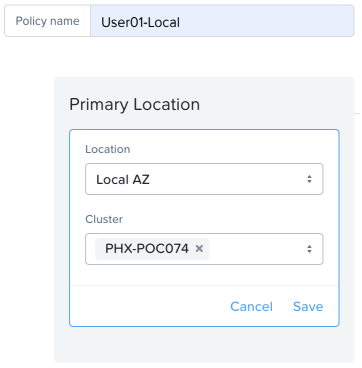

.. _recover_protect:

------------------------------------------------
Protecting Your Environment
------------------------------------------------

Need to make sense of categories used in the Flow steps - TO BE FIXED.

Creating a Protection Policy
+++++++++++++++++++++++++++++

#. In **Prism Central**, select :fa:`bars`  **> Policies > Protection Policies**.
#. Click **Create Protection Policy** and fill out the following:

   - Policy name - **USER##-Local** (ex. USER01-Local)
   - Primary Location > Location - **Local AZ:<Your Cluster>**

#. Click **Save**.
#. Click **Add Local Schedule**.
#. Set:

   - Take Snapshot every **1 Hour**
   - Retention Type: **Linear** 
   - Retention on Local AZ to **5 Recover Points**
 

#. Click **Save Schedule**
#. Within the **Recovery Location**, click **Cancel**.
#. Click **Next**.
 
 
Now, type User## in the search box  and select AppType:User##-FaceRace (ex:User01-FaceRace)

 
#. Click **Add**.
#. Click **Create**.
 
You now have a continuous stream of snapshots protecting these VMs, making it possible to roll back your FaceRace Application to a previous point in time.

------------------------------------------------
Recover from an attack on an isolated VM
------------------------------------------------

Quarantine VM 
++++++++++++++++++++++++++++

You identified that your User##WinTools VM was attacked and is now compromised by Ransomware, so you want to act fast and disable any sort of communication coming from or going to the VM.

   #. In Prism Central, select |||, Virtual Infrastructure > VMs
   #. Check User##WinTools VM, click Action > Quarantine VMs

   #. Select Strict
   #. Click Quarantine

Note:
As you can see, Quarantining a VM in Strict Mode will block all traffic into and out of the VM. You can also use Forensics Mode, which allows the VM to communicate to certain VMs for security teams to investigate what is wrong.

The red icon next to the VM name means that it has been quarantined.
You can Launch the console or RDP to any other VMs from your assigned VMs (User##FaceRace-Web or User##-FaceRace-DB) and ping User##-WinTools VM and observe pings failing to reach the targeted VM.

Bring an infected VM back to a stable state
++++++++++++++++++++++++++++++++++++++++++++

Remember one of your first tasks was to create a Protection Policy and apply it to your assigned VMs? This easily accomplished task will now pay off.

   #. In **Prism Central**, select :fa:`bars` **> Virtual Infrastructure > VMs**.
   #. Click User##-WinTools VM
   #. Look for Recovery Point tab on the top taskbar and click on it

   #. Check the list of the Recovery Points created by your policy

   #. Select the latest snapshot created and click Actions
   #. Select Restore
   #. You have the chance to change the VM name or leave it with the suffix _clone1

   #. Click Restore

   #. Go back to ||| > Virtual Infrastructure > VMs
   #. Look for the newly-created clone (ex: User01-WinTools_clone1)
   #. Confirm you are able to access it and the VM is not infected
